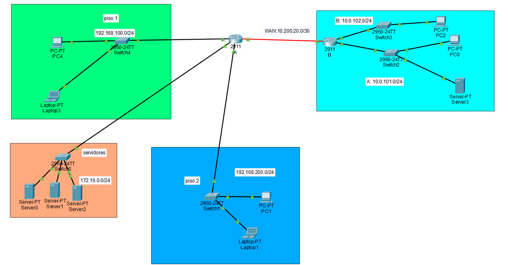

# ACL Extendida en Cisco | Filtra tráfico como un profesional

## 📘 Descripción del proyecto
Aprende a crear ACL extendidas para controlar tráfico por IP origen destino y protocolo

🔗 **Video del laboratorio:**  
🎥 [ACL Extendida en Cisco | Filtra tráfico como un profesional](https://youtu.be/d1iSiGDgmHw)

---

## 🎯 Objetivos del proyecto

1. **Comprender los conceptos clave relacionados con ACL Extendida en Cisco | Filtra tráfico como un profesional.**

2. **Configurar los dispositivos necesarios y aplicar comandos.**

3. **Verificar la conectividad entre dispositivos.**

4. **Probar variantes o extensiones del laboratorio.**

---

## 🧰 Tecnologías y herramientas utilizadas

Cisco Packet Tracer 8.x; Routers Cisco; ACL Extendida; Seguridad de red; CLI

---

## 📂 Estructura del repositorio
12. ACL Extendida en Cisco  Filtra tráfico como un profesional/

├── ACL_Extendida_en_Cisco_Filtra_tráfico.pkt ← Archivo del laboratorio (abrir con Packet Tracer)

├── ACL_Extendida_en_Cisco_Filtra_tráfico.jpg ← Imagen de la topología del proyecto

└── README.md ← Documentación del laboratorio

---

## 🚀 Cómo usarlo

1. Descarga el archivo `.pkt` desde esta carpeta.  
2. Ábrelo con **Cisco Packet Tracer 8.x o superior**.  
3. Revisa la topología y las configuraciones.  
4. Ejecuta pruebas (`ping`, `show ip route`, etc.) para validar la red.  

---

## 🌐 Topología visual

---

## 📝 Notas adicionales

- Proyecto educativo del canal **El Networker TI**  
  🎬 [YouTube - El Networker TI](https://www.youtube.com/@ElNetworkerTI)  
- Más laboratorios disponibles en:  
  💼 [GitHub - Packet Tracer Projects](https://github.com/TU_USUARIO/TU_REPO)

---
