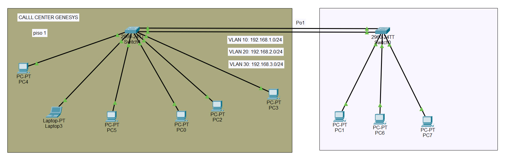

# EtherChannel en Cisco Packet Tracer | Conéctalo paso a paso

## 📘 Descripción del proyecto
Aprende a configurar EtherChannel para agrupar interfaces y mejorar rendimiento y redundancia en switches Cisco

🔗 **Video del laboratorio:**  
🎥 [EtherChannel en Cisco Packet Tracer | Conéctalo paso a paso](https://youtu.be/oJOHjVYxNiY)

---

## 🎯 Objetivos del proyecto

1. **Comprender los conceptos clave relacionados con EtherChannel en Cisco Packet Tracer | Conéctalo paso a paso.**

2. **Configurar los dispositivos necesarios y aplicar comandos.**

3. **Verificar la conectividad entre dispositivos.**

4. **Probar variantes o extensiones del laboratorio.**

---

## 🧰 Tecnologías y herramientas utilizadas

Cisco Packet Tracer 8.x; Switches Cisco; EtherChannel; LACP; PAgP; Trunking

---

## 📂 Estructura del repositorio
9. EtherChannel en Cisco Packet Tracer  Conéctalo paso a paso/

├── EtherChannel_en_Cisco_Packet_Tracer.pkt ← Archivo del laboratorio (abrir con Packet Tracer)

├── EtherChannel_en_Cisco_Packet_Tracer.jpg ← Imagen de la topología del proyecto

└── README.md ← Documentación del laboratorio

---

## 🚀 Cómo usarlo

1. Descarga el archivo `.pkt` desde esta carpeta.  
2. Ábrelo con **Cisco Packet Tracer 8.x o superior**.  
3. Revisa la topología y las configuraciones.  
4. Ejecuta pruebas (`ping`, `show ip route`, etc.) para validar la red.  

---

## 🌐 Topología visual

---

## 📝 Notas adicionales

🌐 Mis redes y recursos:

🌲 Linktree: https://linktr.ee/SoyWilliamsnet

🌀 Discord (comunidad de redes): https://discord.gg/vUfrPXqv

💻 GitHub: https://github.com/SoyWilliamsNet

💡 Substack: https://substack.com/@soywilliamsnet

---
